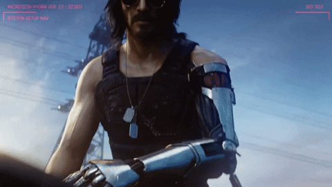
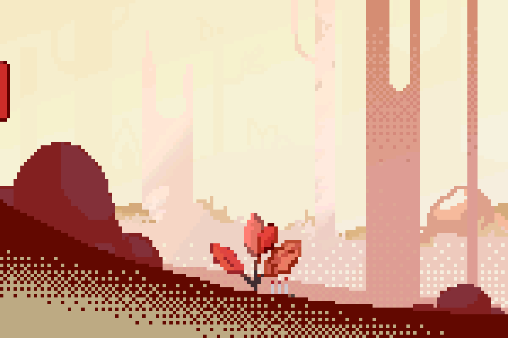

<!--- 

--->
- 👋 Olá! Eu sou o @renatex333
- 👨‍🎓 Estou me graduando em Engenharia da Computação

<!-- Meu Perfil no LinkedIn &rarr;
 -->

##

<!---
Referência para os ícones: https://github.com/devicons/devicon/tree/master/icons
--->

   
  
  
  
  
    

    
 
   
    
  
  
  

    

  
  
  
    
  

    

  
  
  
  
  

    

  
  
  
  
  

    

  
  

    
##

